# 🏦 Banco Demo App - Plataforma de Práctica para Automatización QA

> **Proyecto educativo** para aprender automatización de pruebas con **Selenium (Java)** y **Cypress (JavaScript)** en una aplicación bancaria real.

---

## 📋 Índice

- [Visión General](#-visión-general)
- [Arquitectura](#-arquitectura)
- [Características](#-características)
- [Estructura del Proyecto](#-estructura-del-proyecto)
- [Tecnologías](#-tecnologías)
- [Instalación y Configuración](#-instalación-y-configuración)
- [Guía de Testing](#-guía-de-testing)
- [Datos de Prueba](#-datos-de-prueba)
- [Flujos de Usuario](#-flujos-de-usuario)
- [API Reference](#-api-reference)

---

## 🎯 Visión General

Este proyecto es una **aplicación bancaria completa** diseñada específicamente para practicar automatización de pruebas. Incluye:

- ✅ Backend REST API con Spring Boot
- ✅ Frontend vanilla JavaScript
- ✅ Base de datos H2 en memoria
- ✅ Suite de tests con Selenium Java
- ✅ Suite de tests con Cypress
- ✅ Elementos con `data-testid` para testing

### 🎓 Objetivo Educativo

Proporcionar un ambiente realista para aprender:
- Automatización E2E con Selenium WebDriver
- Testing moderno con Cypress
- Page Object Model (POM)
- Mejores prácticas de QA Automation
- Integración con IA para acelerar desarrollo de tests

---

## 🏗️ Arquitectura

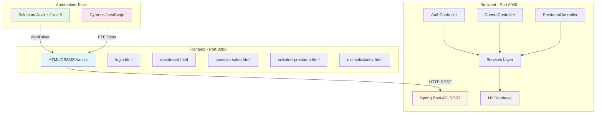

### 🔄 Arquitectura de Capas

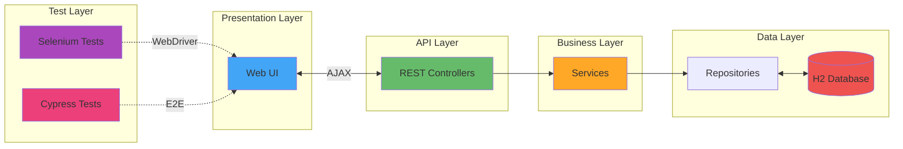

---

## ✨ Características

### 🔐 Sistema de Autenticación
- Login con email y contraseña
- Validación de credenciales
- Gestión de sesión con localStorage
- Cierre de sesión

### 💰 Gestión de Cuentas
- Consulta de saldo en tiempo real
- Visualización de múltiples cuentas
- Información detallada (número, tipo, saldo)
- Formato monetario COP

### 💳 Sistema de Préstamos
- Solicitud de préstamo con validaciones
- Calculadora de cuota mensual
- Selección de propósito (Vehículo, Vivienda, Educación)
- Plazos flexibles (12, 24, 36, 48 meses)
- Historial de solicitudes
- Estados de solicitud (En Revisión, Aprobado, Rechazado)

---

## 📁 Estructura del Proyecto

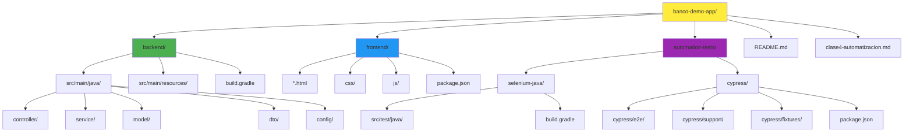

### 📂 Detalle de Directorios

```
banco-demo-app/
│
├── backend/                          # API REST con Spring Boot
│   ├── src/main/java/com/banco/demo/
│   │   ├── BancoApplication.java    # Clase principal
│   │   ├── controller/              # Endpoints REST
│   │   │   ├── AuthController.java
│   │   │   ├── CuentaController.java
│   │   │   └── PrestamoController.java
│   │   ├── service/                 # Lógica de negocio
│   │   ├── model/                   # Entidades JPA
│   │   ├── dto/                     # Data Transfer Objects
│   │   └── config/                  # Configuraciones (CORS)
│   ├── src/main/resources/
│   │   ├── application.properties   # Config de Spring
│   │   └── data.sql                 # Datos iniciales
│   └── build.gradle                 # Dependencias
│
├── frontend/                         # Interfaz de usuario
│   ├── index.html                   # Landing page
│   ├── login.html                   # Página de login
│   ├── dashboard.html               # Panel principal
│   ├── consulta-saldo.html          # Vista de cuentas
│   ├── solicitud-prestamo.html      # Formulario préstamo
│   ├── mis-solicitudes.html         # Historial
│   ├── css/
│   │   └── styles.css               # Estilos globales
│   ├── js/
│   │   ├── api.js                   # Cliente API REST
│   │   ├── auth.js                  # Gestión autenticación
│   │   └── utils.js                 # Utilidades
│   └── package.json                 # Scripts NPM
│
└── automation-tests/                 # Tests automatizados
    ├── selenium-java/               # Tests con Selenium
    │   ├── src/test/java/
    │   │   ├── pages/              # Page Object Model
    │   │   ├── tests/              # Test cases
    │   │   └── base/               # BaseTest
    │   └── build.gradle
    │
    └── cypress/                     # Tests con Cypress
        ├── cypress/
        │   ├── e2e/                # Specs de prueba
        │   ├── support/            # Commands custom
        │   └── fixtures/           # Datos de prueba
        ├── cypress.config.js
        └── package.json
```

---

## 🛠️ Tecnologías

### Backend Stack
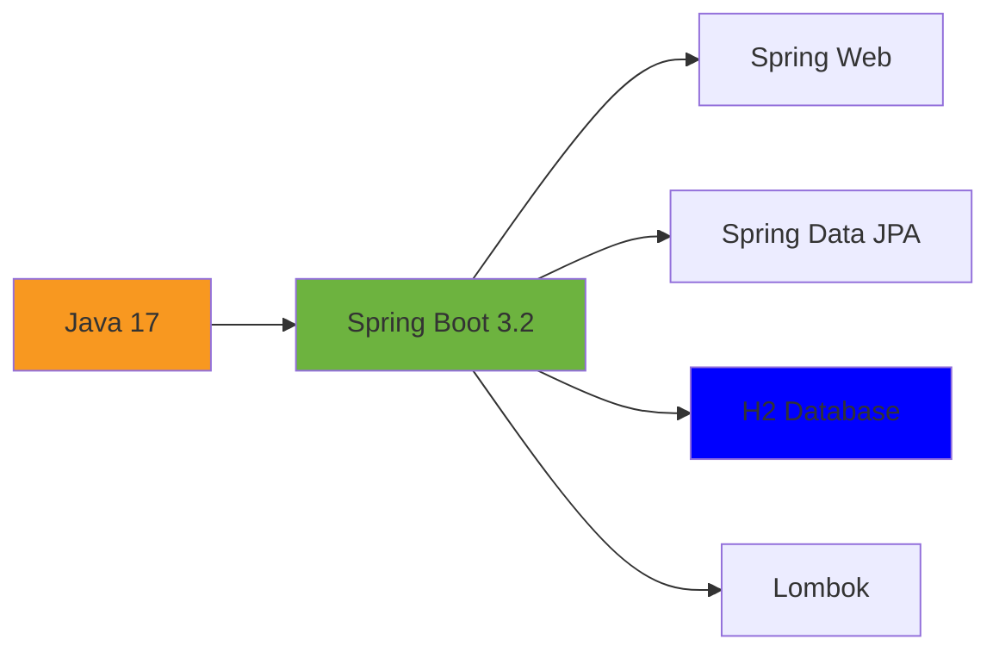

| Tecnología | Versión | Propósito |
|------------|---------|-----------|
| Java | 17 | Lenguaje base |
| Spring Boot | 3.2.0 | Framework backend |
| Spring Web | - | REST API |
| Spring Data JPA | - | ORM |
| H2 Database | - | Base de datos en memoria |
| Gradle | - | Build tool |
| Lombok | - | Reducir boilerplate |

### Frontend Stack
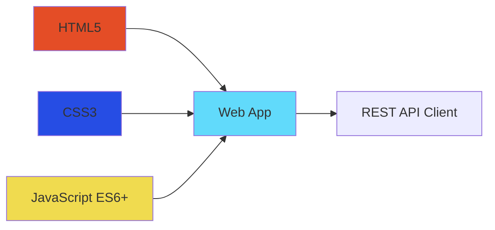

| Tecnología | Propósito |
|------------|-----------|
| HTML5 | Estructura semántica |
| CSS3 | Estilos y responsive |
| JavaScript Vanilla | Lógica cliente |
| Fetch API | Consumo de REST |
| LocalStorage | Persistencia sesión |

### Testing Stack
```mermaid
graph TB
    subgraph "Selenium Java"
        A[Selenium WebDriver 4.16]
        B[JUnit 5]
        C[WebDriverManager 5.6]
        D[AssertJ]
    end
    
    subgraph "Cypress"
        E[Cypress 13.6]
        F[Mocha]
        G[Chai]
    end
    
    A --> H[Chrome Driver]
    E --> H
    
    style A fill:#43b02a
    style E fill:#17202c
    style H fill:#4285f4
```

**Selenium Java:**
- Selenium WebDriver 4.16.1
- JUnit 5 (Jupiter)
- WebDriverManager 5.6.3
- AssertJ 3.24.2
- SLF4J Logger

**Cypress:**
- Cypress 13.6.2
- Mocha Test Runner
- Chai Assertions
- Custom Commands

---

## 🚀 Instalación y Configuración

### Prerrequisitos

```mermaid
graph LR
    A[Java 17+] --> D[Desarrollo Completo]
    B[Node.js 18+] --> D
    C[Gradle 8+] --> D
    
    style A fill:#f89820
    style B fill:#43853d
    style C fill:#02303a
    style D fill:#4caf50
```

- ✅ Java 17 o superior
- ✅ Node.js 18+ y npm
- ✅ Gradle 8+ (opcional, usa wrapper)
- ✅ Git
- ✅ Chrome/Firefox (para tests)

### 1️⃣ Clonar el Repositorio

```bash
git clone https://github.com/YamidTcsDev/clase4-qa-automatizacion.git
cd clase4-qa-automatizacion
```

### 2️⃣ Levantar Backend

```bash
cd backend
./gradlew bootRun
```

✅ Backend corriendo en: **http://localhost:8080**  
✅ H2 Console: **http://localhost:8080/h2-console**

**Configuración H2 Console:**
- JDBC URL: `jdbc:h2:mem:bancodb`
- Username: `sa`
- Password: *(dejar vacío)*

### 3️⃣ Levantar Frontend

```bash
cd frontend
npm install
npm start
```

✅ Frontend corriendo en: **http://localhost:3000**

### 4️⃣ Ejecutar Tests Selenium

```bash
cd automation-tests/selenium-java
./gradlew test
```

📊 Reporte: `build/reports/tests/test/index.html`

### 5️⃣ Ejecutar Tests Cypress

```bash
cd automation-tests/cypress
npm install
npx cypress run
```

🎥 Modo interactivo:
```bash
npx cypress open
```

---

## 🧪 Guía de Testing

### 📊 Estrategia de Testing

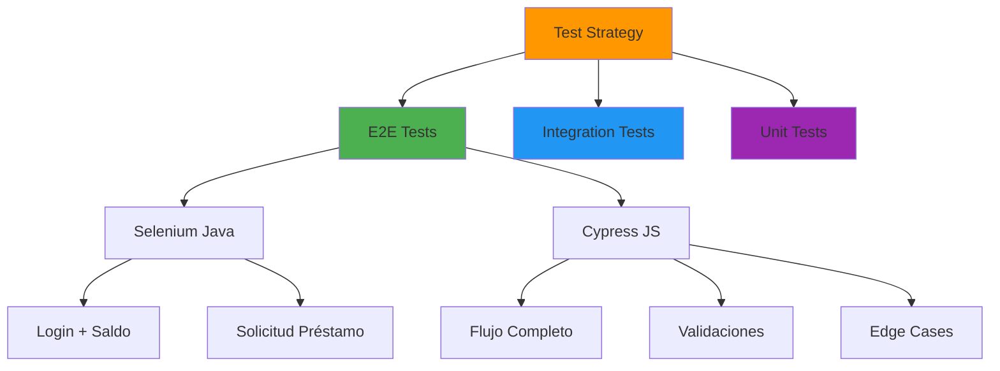

### 🎯 Casos de Prueba

#### Ejemplo 1: Login + Consulta Saldo

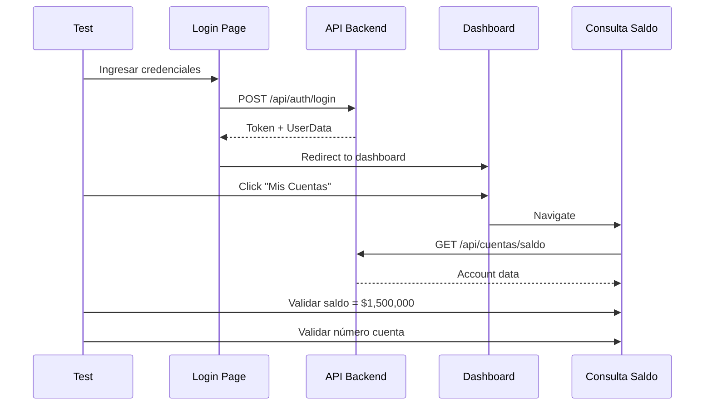

**Pasos:**
1. ✅ Navegar a login
2. ✅ Ingresar email: `test.qa@banco.com`
3. ✅ Ingresar password: `TestQA2024!`
4. ✅ Click en "Iniciar Sesión"
5. ✅ Validar redirección a dashboard
6. ✅ Click en "Mis Cuentas"
7. ✅ Validar saldo: **$1,500,000 COP**
8. ✅ Validar tipo: **Ahorros**

#### Ejemplo 2: Solicitud de Préstamo

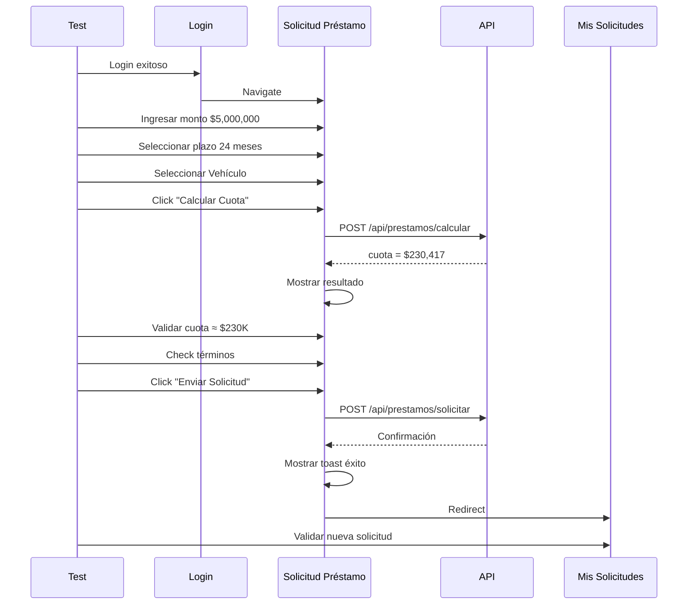

**Pasos:**
1. ✅ Login con `qa.test@banco.com`
2. ✅ Navegar a "Préstamos"
3. ✅ Ingresar monto: **$5,000,000**
4. ✅ Seleccionar plazo: **24 meses**
5. ✅ Seleccionar propósito: **Vehículo**
6. ✅ Click "Calcular Cuota"
7. ✅ Validar cuota: **≈ $230,417**
8. ✅ Aceptar términos y condiciones
9. ✅ Click "Enviar Solicitud"
10. ✅ Validar toast de éxito
11. ✅ Validar redirección
12. ✅ Validar solicitud en listado

### 🔍 Selectores para Testing

Todos los elementos críticos tienen `data-testid`:

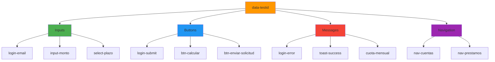

**Lista completa:**
- `login-email`, `login-password`, `login-submit`
- `nav-cuentas`, `nav-prestamos`
- `saldo-amount`, `cuenta-numero`, `tipo-cuenta`
- `input-monto`, `select-plazo`
- `radio-proposito-vehiculo`, `radio-proposito-vivienda`, `radio-proposito-educacion`
- `btn-calcular`, `cuota-mensual`
- `checkbox-terminos`, `btn-enviar-solicitud`
- `spinner`, `toast-success`
- `solicitud-card`, `numero-solicitud`, `estado-solicitud`

---

## 👥 Datos de Prueba

### 🔐 Credenciales de Usuarios

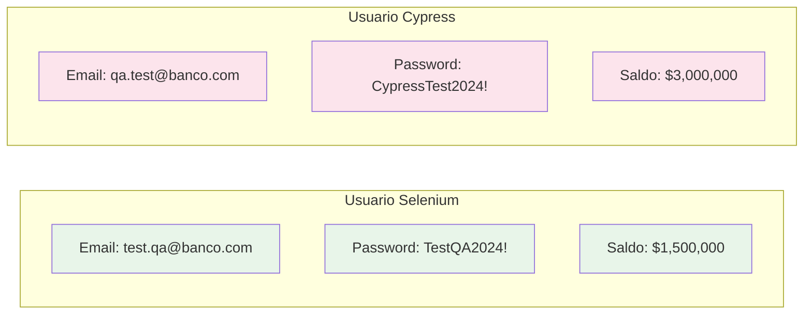

| Usuario | Email | Password | Cuenta | Saldo |
|---------|-------|----------|--------|-------|
| QA Tester | test.qa@banco.com | TestQA2024! | **** 7890 | $1,500,000 COP |
| Cypress User | qa.test@banco.com | CypressTest2024! | **** 6677 | $3,000,000 COP |

### 💰 Cuentas Precargadas

```sql
-- Usuario 1: QA Tester
Cuenta Ahorros: 1234567890 → $1,500,000
Cuenta Corriente: 0987654321 → $500,000

-- Usuario 2: Cypress User  
Cuenta Ahorros: 5555666677 → $3,000,000
```

### 📋 Solicitudes Existentes

Usuario Cypress tiene 1 solicitud previa:
- **Número:** SOL-20241115-0001
- **Monto:** $5,000,000
- **Plazo:** 24 meses
- **Cuota:** $230,417
- **Estado:** En Revisión

---

## 🔄 Flujos de Usuario

### 🎯 Flujo Principal: Solicitud de Préstamo

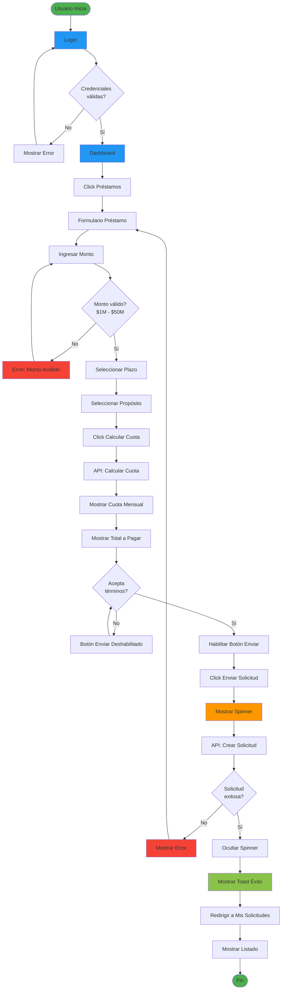

### 🔐 Flujo de Autenticación

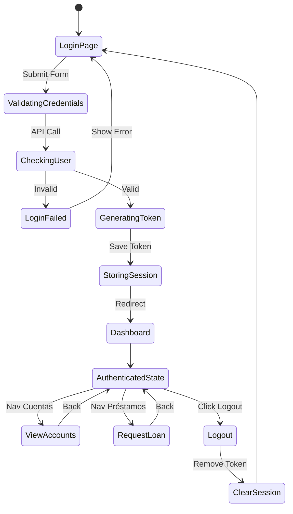

---

## 🌐 API Reference

### 🔌 Endpoints Disponibles

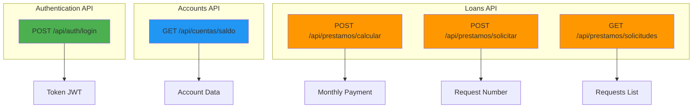

### 1. 🔐 Autenticación

#### POST `/api/auth/login`

**Request:**
```json
{
  "email": "test.qa@banco.com",
  "password": "TestQA2024!"
}
```

**Response (200 OK):**
```json
{
  "token": "eyJhbGciOiJIUzI1NiIsInR5cCI6IkpXVCJ9...",
  "nombre": "QA Tester",
  "userId": 1
}
```

**Response (401 Unauthorized):**
```json
{
  "error": "Credenciales inválidas"
}
```

### 2. 💰 Consulta de Saldo

#### GET `/api/cuentas/saldo?userId={id}`

**Headers:**
```
Authorization: Bearer {token}
```

**Response (200 OK):**
```json
{
  "numeroCuenta": "****7890",
  "saldo": 1500000.00,
  "moneda": "COP",
  "tipoCuenta": "AHORROS"
}
```

### 3. 🧮 Calcular Cuota

#### POST `/api/prestamos/calcular`

**Request:**
```json
{
  "monto": 5000000,
  "plazoMeses": 24
}
```

**Response (200 OK):**
```json
{
  "cuotaMensual": 230417,
  "tasaInteres": 1.5,
  "totalPagar": 5530008
}
```

### 4. 📝 Solicitar Préstamo

#### POST `/api/prestamos/solicitar`

**Request:**
```json
{
  "userId": 2,
  "monto": 5000000,
  "plazoMeses": 24,
  "proposito": "Vehiculo"
}
```

**Response (201 Created):**
```json
{
  "numeroSolicitud": "SOL-20241125-0001",
  "estado": "EN_REVISION",
  "fechaCreacion": "2024-11-25T10:30:00Z"
}
```

### 5. 📋 Listar Solicitudes

#### GET `/api/prestamos/solicitudes?userId={id}`

**Response (200 OK):**
```json
[
  {
    "numeroSolicitud": "SOL-20241125-0001",
    "monto": 5000000,
    "plazoMeses": 24,
    "cuotaMensual": 230417,
    "estado": "EN_REVISION",
    "fechaSolicitud": "2024-11-25"
  }
]
```

---

## 📊 Comparativa: Testing Manual vs Automatizado

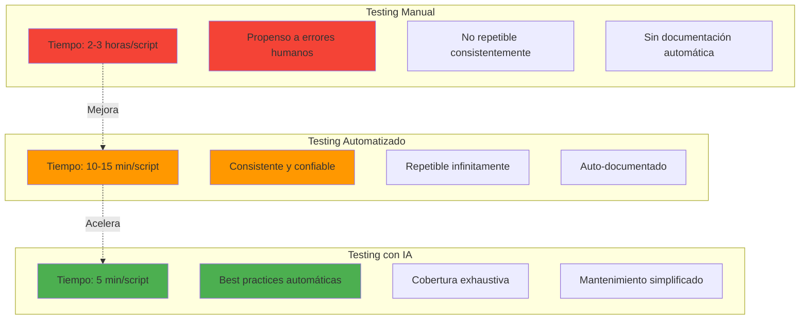

| Aspecto | Manual | Automatizado | Con IA |
|---------|--------|--------------|--------|
| **Tiempo desarrollo** | 2-3 horas | 30-60 min | 5-15 min |
| **Repetibilidad** | ❌ Baja | ✅ Alta | ✅ Alta |
| **Consistencia** | ❌ Variable | ✅ Constante | ✅ Constante |
| **Documentación** | ❌ Mínima | ⚠️ Parcial | ✅ Completa |
| **Mantenimiento** | ❌ Difícil | ⚠️ Moderado | ✅ Fácil |
| **Cobertura** | ❌ Básica | ⚠️ Media | ✅ Exhaustiva |
| **Curva aprendizaje** | ✅ Baja | ❌ Alta | ✅ Media |

---

## 🎓 Recursos de Aprendizaje

### 📚 Documentación Oficial
- [Selenium Documentation](https://www.selenium.dev/documentation/)
- [Cypress Documentation](https://docs.cypress.io/)
- [Spring Boot Docs](https://spring.io/projects/spring-boot)
- [JUnit 5 User Guide](https://junit.org/junit5/docs/current/user-guide/)

### 🎥 Tutoriales Recomendados
- Selenium WebDriver with Java
- Cypress Modern Testing
- Page Object Model Pattern
- Test Automation Best Practices

### 🛠️ Herramientas Útiles
- **Chrome DevTools** - Inspeccionar elementos
- **Selenium IDE** - Grabar tests
- **Cypress Dashboard** - Monitoreo de tests
- **Postman** - Testing de API

---

## 🐛 Troubleshooting

### ❌ Problema: Backend no inicia

```bash
# Verificar puerto 8080 libre
netstat -ano | findstr :8080

# Matar proceso si está ocupado
taskkill /PID <PID> /F

# Reiniciar backend
./gradlew bootRun
```

### ❌ Problema: Frontend no carga datos

```javascript
// Verificar CORS en backend (CorsConfig.java)
@Override
public void addCorsMappings(CorsRegistry registry) {
    registry.addMapping("/**")
            .allowedOrigins("http://localhost:3000")
            .allowedMethods("GET", "POST", "PUT", "DELETE");
}
```

### ❌ Problema: Tests Selenium fallan

```java
// Verificar ChromeDriver actualizado
WebDriverManager.chromedriver().setup();

// Aumentar timeouts
WebDriverWait wait = new WebDriverWait(driver, Duration.ofSeconds(15));
```

### ❌ Problema: Cypress no encuentra elementos

```javascript
// Usar data-testid en lugar de clases/ids
cy.get('[data-testid="login-email"]').type('test@banco.com');

// Aumentar timeout si elemento tarda en cargar
cy.get('[data-testid="saldo-amount"]', { timeout: 10000 })
  .should('be.visible');
```

---

## 🤝 Contribuciones

¿Quieres mejorar este proyecto? ¡Contribuciones son bienvenidas!

1. Fork el repositorio
2. Crea una rama: `git checkout -b feature/nueva-funcionalidad`
3. Commit cambios: `git commit -m 'Add: nueva funcionalidad'`
4. Push a la rama: `git push origin feature/nueva-funcionalidad`
5. Abre un Pull Request

---

## 📄 Licencia

Este proyecto es de uso educativo y está disponible bajo licencia MIT.

---

## 👨‍💻 Autor

**Yamid TCS Dev**
- GitHub: [@YamidTcsDev](https://github.com/YamidTcsDev)
- Proyecto: Clase 4 QA Automatización

---

## 📞 Soporte

¿Preguntas o problemas?
- 📧 Email: [Contacto del instructor]
- 💬 Issues: [GitHub Issues](https://github.com/YamidTcsDev/clase4-qa-automatizacion/issues)

---

<div align="center">

### 🚀 ¡Comienza a automatizar ahora!

```bash
# Clone, Build, Test
git clone https://github.com/YamidTcsDev/clase4-qa-automatizacion.git
cd clase4-qa-automatizacion
# Sigue las instrucciones de instalación arriba
```

**Hecho con ❤️ para la comunidad QA**

</div>
