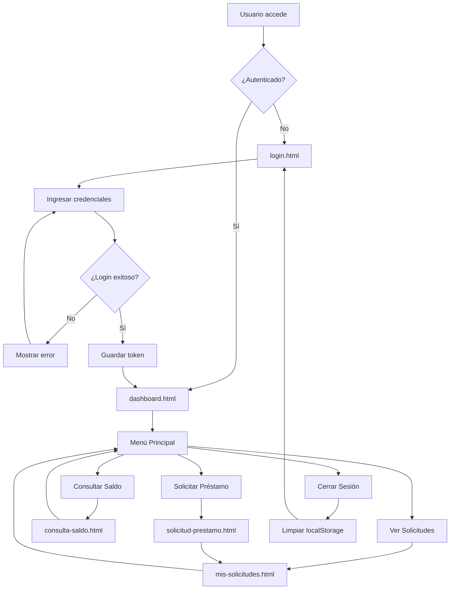
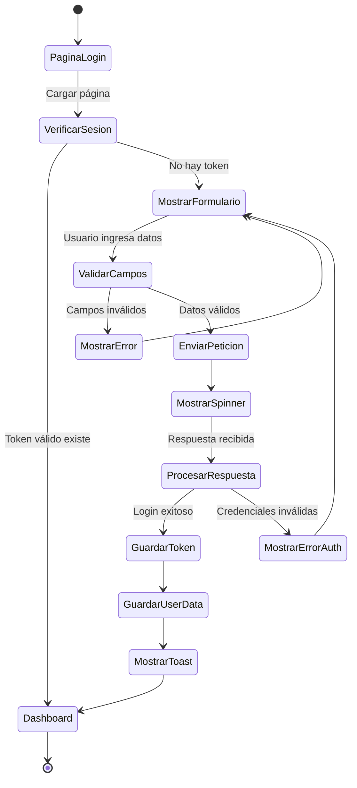
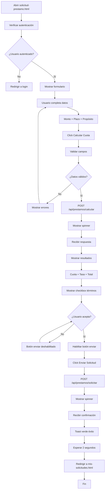
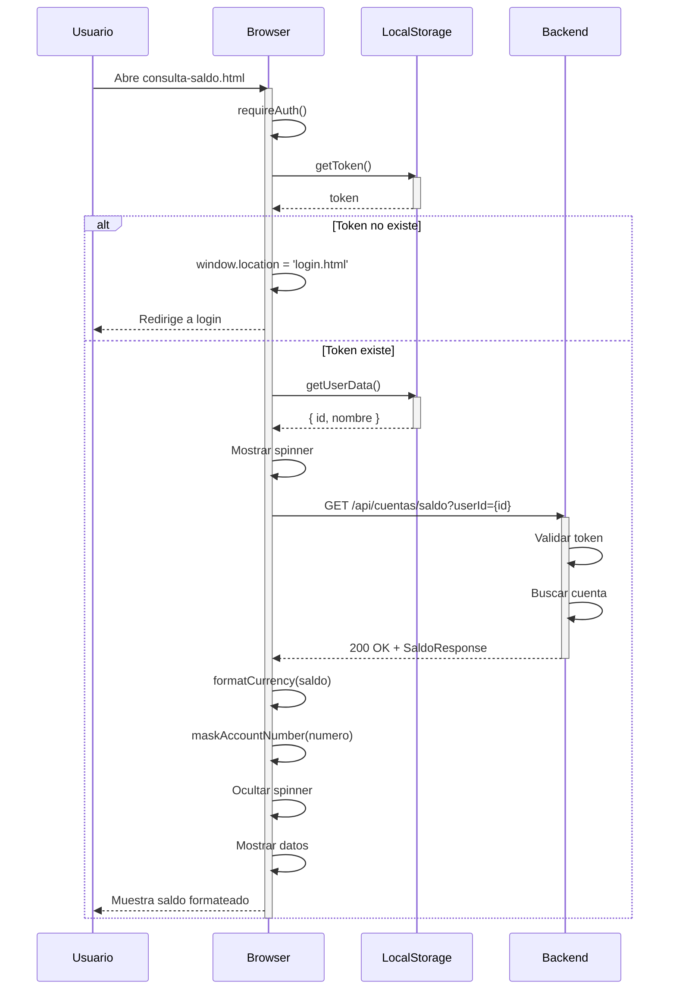
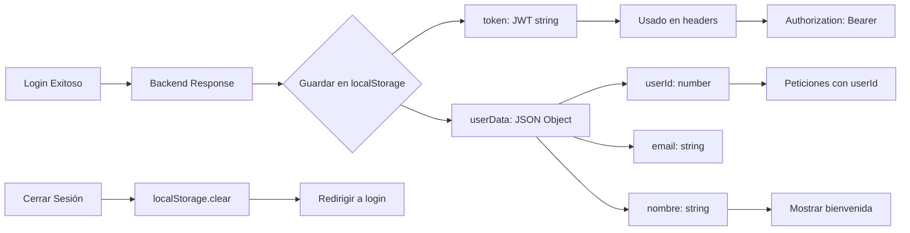
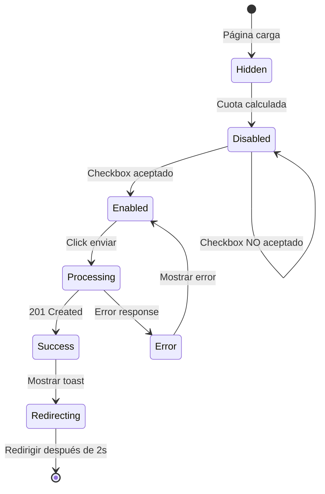

# 🌐 Banco Demo - Frontend

Aplicación web bancaria desarrollada con **HTML5, CSS3 y JavaScript Vanilla** (sin frameworks). Diseñada específicamente para testing automatizado con **Selenium** y **Cypress**.

## 📋 Tabla de Contenidos

- [Características](#características)
- [Estructura](#estructura)
- [Páginas](#páginas)
- [Tecnologías](#tecnologías)
- [Instalación](#instalación)
- [Configuración](#configuración)
- [Diagramas](#diagramas)
- [Testing](#testing)
- [Guía de Uso](#guía-de-uso)

## ✨ Características

- 🎨 **UI Moderna** - Diseño gradiente con animaciones CSS
- 📱 **Responsive Design** - Adaptable a móviles y tablets
- 🔐 **Autenticación JWT** - Manejo de sesiones con localStorage
- ✅ **Validación Frontend** - Validación de campos antes de enviar
- 🎯 **Data-TestID** - Todos los elementos con selectores para testing
- 🔄 **SPA-like Navigation** - Navegación sin recarga de página
- 💫 **UX Mejorada** - Spinners, toasts y feedback visual
- 🌐 **API Integration** - Conexión con backend en localhost:8080

## 📂 Estructura del Proyecto

```
frontend/
├── login.html              # Página de inicio de sesión
├── dashboard.html          # Panel principal del usuario
├── consulta-saldo.html     # Consulta de saldo de cuenta
├── solicitud-prestamo.html # Formulario de préstamo
├── mis-solicitudes.html    # Historial de solicitudes
├── styles.css              # Estilos globales
├── utils.js                # Funciones utilitarias
└── README.md               # Este archivo
```

## 📄 Páginas

### 1. 🔐 login.html

**Página de autenticación de usuarios**

**Funcionalidades:**
- Formulario email/password
- Validación de formato de email
- Validación de campos requeridos
- Manejo de errores de autenticación
- Redirección automática a dashboard
- Almacenamiento de token JWT

**Data-TestIDs:**
- `login-email` - Input de email
- `login-password` - Input de contraseña
- `login-submit` - Botón de envío

**API:**
```javascript
POST /api/auth/login
Body: { email, password }
Response: { token, nombre, userId }
```

### 2. 🏠 dashboard.html

**Panel de control principal**

**Funcionalidades:**
- Mensaje de bienvenida personalizado
- Menú de navegación
- Accesos rápidos a funcionalidades
- Botón de cierre de sesión
- Verificación de autenticación

**Data-TestIDs:**
- `user-welcome` - Mensaje de bienvenida
- `nav-cuentas` - Link a consulta de saldo
- `nav-prestamos` - Link a préstamos
- `btn-logout` - Botón cerrar sesión

### 3. 💰 consulta-saldo.html

**Consulta de información de cuenta**

**Funcionalidades:**
- Mostrar número de cuenta enmascarado
- Visualizar saldo con formato COP
- Mostrar tipo de cuenta
- Estado de carga con spinner
- Manejo de errores

**Data-TestIDs:**
- `cuenta-numero` - Número de cuenta
- `tipo-cuenta` - Tipo de cuenta
- `saldo-amount` - Saldo disponible

**API:**
```javascript
GET /api/cuentas/saldo?userId={id}
Response: { numeroCuenta, tipoCuenta, saldo }
```

### 4. 📋 solicitud-prestamo.html

**Formulario de solicitud de préstamo**

**Funcionalidades:**
- Input de monto del préstamo
- Selector de plazo en meses
- Radio buttons para propósito
- Botón calcular cuota mensual
- Mostrar resultado del cálculo
- Checkbox de términos y condiciones
- Botón enviar solicitud (habilitado condicionalmente)
- Spinner durante procesamiento
- Toast de confirmación
- Redirección automática

**Data-TestIDs:**
- `input-monto` - Campo de monto
- `select-plazo` - Selector de plazo
- `radio-proposito-vehiculo` - Opción vehículo
- `radio-proposito-vivienda` - Opción vivienda
- `radio-proposito-personal` - Opción personal
- `btn-calcular` - Botón calcular
- `cuota-mensual` - Cuota calculada
- `tasa-interes` - Tasa aplicada
- `total-pagar` - Total a pagar
- `checkbox-terminos` - Aceptar términos
- `btn-enviar-solicitud` - Enviar solicitud
- `spinner` - Indicador de carga
- `toast-success` - Notificación exitosa

**API:**
```javascript
POST /api/prestamos/calcular
Body: { monto, plazoMeses, proposito }
Response: { cuotaMensual, tasaInteres, totalPagar }

POST /api/prestamos/solicitar
Body: { userId, monto, plazoMeses, proposito }
Response: { numeroSolicitud, estado }
```

### 5. 📑 mis-solicitudes.html

**Historial de solicitudes de préstamo**

**Funcionalidades:**
- Listado en grid de cards
- Información detallada por solicitud
- Estados con colores diferenciados
- Formato de fechas localizadas
- Estado vacío cuando no hay solicitudes
- Manejo de errores

**Data-TestIDs:**
- `solicitud-card` - Card de solicitud
- `numero-solicitud` - Número único
- `estado-solicitud` - Estado actual

**API:**
```javascript
GET /api/prestamos/solicitudes?userId={id}
Response: [ { id, monto, plazoMeses, cuotaMensual, proposito, estado, fechaSolicitud } ]
```

## 🛠️ Tecnologías

| Tecnología | Versión | Propósito |
|------------|---------|-----------|
| HTML5 | - | Estructura de páginas |
| CSS3 | - | Estilos y animaciones |
| JavaScript | ES6+ | Lógica de cliente |
| Fetch API | - | Peticiones HTTP |
| LocalStorage API | - | Almacenamiento de sesión |

## 🚀 Instalación

### Requisitos Previos

- ✅ **Backend corriendo** en http://localhost:8080
- ✅ **Navegador moderno** (Chrome, Firefox, Edge)
- ✅ **Servidor HTTP local** (Live Server, http-server, etc.)

### Opción 1: VS Code Live Server

1. Instalar extensión **Live Server**
2. Click derecho en `login.html`
3. Seleccionar "Open with Live Server"
4. Se abrirá en http://127.0.0.1:5500

### Opción 2: Python HTTP Server

```bash
cd frontend
python -m http.server 5500
```

Abrir http://localhost:5500/login.html

### Opción 3: Node.js http-server

```bash
npm install -g http-server
cd frontend
http-server -p 5500
```

## ⚙️ Configuración

### utils.js - Configuración de API

```javascript
const API_BASE_URL = 'http://localhost:8080';
```

Para cambiar el servidor backend, modificar esta constante.

### CORS en Backend

El backend debe permitir peticiones desde:
- `http://localhost:5500`
- `http://127.0.0.1:5500`

## 📊 Diagramas

### Diagrama de Flujo - Navegación General



### Diagrama de Actividades - Proceso de Login



### Diagrama de Flujo - Solicitud de Préstamo



### Diagrama de Secuencia - Consulta de Saldo



### Flujo de Datos - LocalStorage



### Diagrama de Estados - Botón Enviar Solicitud



## 🎯 Data-TestIDs para Testing

### Selectores por Página

#### Login
```javascript
// Campos
document.querySelector('[data-testid="login-email"]')
document.querySelector('[data-testid="login-password"]')
document.querySelector('[data-testid="login-submit"]')
```

#### Dashboard
```javascript
// Navegación
document.querySelector('[data-testid="user-welcome"]')
document.querySelector('[data-testid="nav-cuentas"]')
document.querySelector('[data-testid="nav-prestamos"]')
document.querySelector('[data-testid="btn-logout"]')
```

#### Consulta Saldo
```javascript
// Información
document.querySelector('[data-testid="cuenta-numero"]')
document.querySelector('[data-testid="tipo-cuenta"]')
document.querySelector('[data-testid="saldo-amount"]')
```

#### Solicitud Préstamo
```javascript
// Formulario
document.querySelector('[data-testid="input-monto"]')
document.querySelector('[data-testid="select-plazo"]')
document.querySelector('[data-testid="radio-proposito-vehiculo"]')
document.querySelector('[data-testid="btn-calcular"]')

// Resultado
document.querySelector('[data-testid="cuota-mensual"]')
document.querySelector('[data-testid="checkbox-terminos"]')
document.querySelector('[data-testid="btn-enviar-solicitud"]')
document.querySelector('[data-testid="spinner"]')
document.querySelector('[data-testid="toast-success"]')
```

#### Mis Solicitudes
```javascript
// Cards
document.querySelectorAll('[data-testid="solicitud-card"]')
document.querySelector('[data-testid="numero-solicitud"]')
document.querySelector('[data-testid="estado-solicitud"]')
```

## 🧪 Testing

### Ejemplo con Selenium (Python)

```python
from selenium import webdriver
from selenium.webdriver.common.by import By
from selenium.webdriver.support.ui import WebDriverWait
from selenium.webdriver.support import expected_conditions as EC

driver = webdriver.Chrome()
driver.get('http://localhost:5500/login.html')

# Login
email_input = driver.find_element(By.CSS_SELECTOR, '[data-testid="login-email"]')
password_input = driver.find_element(By.CSS_SELECTOR, '[data-testid="login-password"]')
submit_btn = driver.find_element(By.CSS_SELECTOR, '[data-testid="login-submit"]')

email_input.send_keys('qa.tester@banco.com')
password_input.send_keys('password123')
submit_btn.click()

# Esperar redirección
WebDriverWait(driver, 10).until(
    EC.url_contains('dashboard.html')
)

# Navegar a consulta saldo
nav_cuentas = driver.find_element(By.CSS_SELECTOR, '[data-testid="nav-cuentas"]')
nav_cuentas.click()

# Verificar saldo cargado
saldo = WebDriverWait(driver, 10).until(
    EC.presence_of_element_located((By.CSS_SELECTOR, '[data-testid="saldo-amount"]'))
)

print(f"Saldo: {saldo.text}")
```

### Ejemplo con Cypress (JavaScript)

```javascript
describe('Flujo de Solicitud de Préstamo', () => {
  it('Debería solicitar un préstamo exitosamente', () => {
    // Login
    cy.visit('http://localhost:5500/login.html')
    cy.get('[data-testid="login-email"]').type('qa.tester@banco.com')
    cy.get('[data-testid="login-password"]').type('password123')
    cy.get('[data-testid="login-submit"]').click()
    
    // Navegar a préstamos
    cy.url().should('include', 'dashboard.html')
    cy.get('[data-testid="nav-prestamos"]').click()
    
    // Llenar formulario
    cy.get('[data-testid="input-monto"]').type('10000000')
    cy.get('[data-testid="select-plazo"]').select('36')
    cy.get('[data-testid="radio-proposito-vehiculo"]').click()
    
    // Calcular
    cy.get('[data-testid="btn-calcular"]').click()
    cy.get('[data-testid="cuota-mensual"]').should('be.visible')
    
    // Enviar solicitud
    cy.get('[data-testid="checkbox-terminos"]').check()
    cy.get('[data-testid="btn-enviar-solicitud"]').click()
    
    // Verificar éxito
    cy.get('[data-testid="toast-success"]').should('be.visible')
    cy.url().should('include', 'mis-solicitudes.html', { timeout: 3000 })
  })
})
```

## 📖 Guía de Uso

### 1. Primer Uso

1. **Levantar backend**: Asegúrate que el backend esté corriendo en puerto 8080
2. **Abrir frontend**: Usar Live Server u otro servidor HTTP en puerto 5500
3. **Login**: Usar credenciales de prueba:
   - Email: `qa.tester@banco.com`
   - Password: `password123`

### 2. Consultar Saldo

1. Desde dashboard, click en "Mis Cuentas"
2. Ver información de cuenta con saldo formateado

### 3. Solicitar Préstamo

1. Desde dashboard, click en "Préstamos"
2. Ingresar monto (ej: 10000000)
3. Seleccionar plazo (ej: 36 meses)
4. Elegir propósito (vehículo, vivienda, personal)
5. Click "Calcular Cuota"
6. Revisar cuota mensual, tasa y total
7. Aceptar términos y condiciones
8. Click "Enviar Solicitud"
9. Esperar confirmación y redirección

### 4. Ver Historial

1. Click en "Mis Solicitudes" desde cualquier página
2. Ver todas las solicitudes con su estado

## 🎨 Personalización de Estilos

### Colores Principales

```css
/* styles.css */
--primary-color: #667eea;
--secondary-color: #764ba2;
--success-color: #27ae60;
--error-color: #e74c3c;
--warning-color: #f39c12;
```

### Responsive Breakpoints

```css
@media (max-width: 768px) {
  /* Estilos para tablets */
}

@media (max-width: 480px) {
  /* Estilos para móviles */
}
```

## 🔧 Solución de Problemas

### CORS Error

**Error**: `Access to fetch at 'http://localhost:8080' from origin 'http://localhost:5500' has been blocked by CORS policy`

**Solución**: Verificar configuración CORS en backend

### Token Inválido

**Error**: Redirección constante a login

**Solución**:
```javascript
// Limpiar localStorage
localStorage.clear()
// Volver a iniciar sesión
```

### API Connection Refused

**Error**: `ERR_CONNECTION_REFUSED`

**Solución**: Verificar que el backend esté corriendo en puerto 8080

## 📱 Compatibilidad de Navegadores

| Navegador | Versión Mínima | Soporte |
|-----------|----------------|---------|
| Chrome | 90+ | ✅ Completo |
| Firefox | 88+ | ✅ Completo |
| Edge | 90+ | ✅ Completo |
| Safari | 14+ | ✅ Completo |
| Opera | 76+ | ✅ Completo |

## 📄 Licencia

Este proyecto es parte del material de formación de TCS - Banistmo.

## 👥 Autores

**Equipo de QA Automation - IA Banistmo**

---

**Última actualización:** Diciembre 2025
